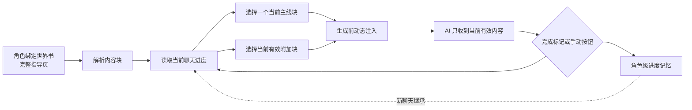

# 动态指导助手

当前版本：**v1.3.5**

动态指导助手让作者把完整剧情流程、物品出现时机、地点规则或秘密写在一个角色绑定世界书条目中。脚本会禁用这个来源条目，并在每次生成前只向 AI 注入当前有效内容。过去与未来的内容不会进入本次提示词。进度记在角色上，推进到后面的阶段后新建聊天会自动接着上次继续。

## 作者使用流程

普通用户推荐走可视化流程，不需要记忆任何模板格式：

1. 给角色绑定一个世界书。
2. 在世界书中创建一个条目，像写大纲一样把剧情、物品出现时机或秘密连续写下去。可以用空行或小标题分隔，例如“雨夜初遇”“地下室的声音”“进入地下室”。
3. 导入并启用“动态指导助手”脚本。
4. 点击酒馆左下角魔法棒，在菜单中打开“动态指导助手”。
5. 在独立管理页中选择角色世界书和刚创建的条目，点击“划分提示词阶段”。
6. 在标注器里点“＋ 新建”增加剧情阶段，写出阶段名称、标记颜色和“什么时候进入下一阶段”。
7. 选中属于这一阶段的文字。手机默认用“点选头尾”：点一下开头、再点一下结尾，中间会自动加入待分配；可以继续点选多处不连续文字，最后点击“分配给当前阶段”一次性写入。电脑或习惯拖选的用户可以在“选择方式”里切回“拖选文字”。
8. 不想分阶段、但每次都要发给 AI 的内容，选中后点击“设为常驻提示”。
9. 点击“保存并绑定”。来源条目会被自动禁用，世界书正文保持原样。
10. 保存或导出角色卡。阶段划分存放在世界书条目的隐藏扩展数据里，会跟随条目一起分享。

已经有旧版模板的用户可以继续沿用 `【内容：名称】` 格式，不需要重新划分。

## 进度会跟着角色保留

绑定关系、阶段划分和剧情进度都记在角色身上。推进到第二段以后再新建聊天，AI 收到的仍然是第二段，不需要重新走一遍已经完成的剧情。

- 每个聊天各自记着自己的进度，改动一个聊天不会影响其他已经进行中的聊天。
- 新聊天第一次生成或打开管理页时，会从角色记住的进度继续，并在管理页提示“这是一个新聊天，已从上次进度继续”。
- 想让之后的聊天也从第一段开始，在管理页点“重置到第一段”。这一步会同时重写角色记住的进度。
- 重新绑定指导条目同样会从第一段开始。

## 旧版模板流程

1. 给角色绑定一个世界书。
2. 在世界书中创建一个条目，例如“动态指导”。
3. 按下面的模板连续写入内容块。
4. 导入并启用“动态指导助手”脚本。
5. 点击酒馆左下角魔法棒，在菜单中打开“动态指导助手”。
6. 在独立管理页中选择角色世界书和刚创建的条目，点击“绑定所选条目”。
7. 在同一页面查看实际发送内容；需要时使用“下一段”“上一段”“重置到第一段”。
8. 保存或导出角色卡。绑定配置和被禁用的来源条目会跟随角色，其他用户导入后即可开始游玩。

## 在线加载

远程 `index.js` 会自行在左下角魔法棒菜单注册“动态指导助手”入口。酒馆助手脚本正文可以只写一行：

```js
import 'https://gcore.jsdelivr.net/gh/PlayerAlex/sillytavern-dynamic-guide@v1.3.5/index.js';
```

推荐普通用户直接导入仓库提供的“在线版 JSON”，不需要手动配置按钮。固定版本地址不会在作者发布新版本时突然改变；需要升级时，把地址中的版本号换成新版本即可。

## 最简创作模板

```text
【内容：雨夜初遇】

什么时候出现：
游戏开始时

告诉AI：
{{char}}第一次在雨夜遇见{{user}}。
这一阶段两人需要进行第一次正式交谈。
{{char}}可以对{{user}}产生初步兴趣。
暂时不要透露地下室的秘密。

什么时候消失：
两人完成第一次正式交谈。


【内容：地下室的声音】

什么时候出现：
上一段结束后

告诉AI：
夜深后，地下室会传来断续的敲击声。
{{char}}知道声音不正常，但仍不愿说明真相。

什么时候消失：
{{user}}决定调查地下室。


【内容：进入地下室】

什么时候出现：
上一段结束后

告诉AI：
两人正式进入地下室。
现在可以逐步揭示地下室的秘密。

什么时候消失：
地下室事件结束。
```

不填写“类型”时，这一块就是主线内容。主线按照它们在条目中的顺序推进，同一时间只发送一段。

## 临时物品、地点和秘密

填写“类型”后，这一块会作为附加内容跟随主线，不会占用主线进度。

```text
【内容：蚀月戒指】

类型：重要物品

什么时候出现：
《进入地下室》正在进行时

告诉AI：
戒指能看见灵体。
副作用是佩戴者会逐渐分不清死人和活人。

什么时候消失：
《进入地下室》结束时
```

第一版能识别的常用写法：

- `游戏开始时`
- `上一段结束后`
- `《某个内容名》正在进行时`
- `《某个内容名》结束后`
- `进入某地点时`、`离开某地点时`，前提是能对应到一个主线内容名

## 划好的阶段存在哪里

可视化划分不会改动世界书正文。每个被标记的文字范围会记录“原文片段、前面一段文字、后面一段文字”三个定位信息，统一保存在条目的隐藏扩展数据 `entry.extra.dynamicGuideAssistant.layout` 里。

有了这三个定位信息，作者之后再修改大纲、在段落前面插入新文字或改写周边描述时，脚本会自动把标记挪回正确的位置。如果某段被标记的文字被整段删除，管理页会提示“有选区无法定位”，此时打开标注器重新选择那一段即可。

同一阶段可以包含多处不连续文字，例如把“雨夜初遇”开头的一句人物状态和后面一句禁止事项都放进第一阶段，它们会按原文顺序拼接后一起发送。标记之间不会重叠，把一段文字分配给新阶段时，它会自动从原阶段移除。

## 运行架构



- 作者配置保存在角色变量 `$dynamicGuideAssistant.config`。
- 可视化阶段划分保存在世界书条目的隐藏扩展数据 `entry.extra.dynamicGuideAssistant.layout`，条目正文保持原样。
- 角色级进度保存在角色变量 `$dynamicGuideAssistant.progress`，按“世界书名 + 条目 UID”记录角色最近一次推进到哪一段。
- 当前聊天的进度保存在聊天变量 `$dynamicGuideAssistant.state`。聊到自己的一份进度时以聊天为准，聊天里还没有进度时先继承角色级记录，再写回聊天变量。
- 来源世界书条目会被设为禁用，避免 SillyTavern 原生世界书把完整内容直接发给 AI。
- 每次生成前使用固定注入 ID 写入当前内容，生成后自动失效。
- AI 只有在判断本次回复已经满足当前完成条件时，才会输出隐藏 HTML 完成标记。脚本检测后推进到下一段，并清理该标记。
- 如果 AI 没有正确判断，用户可以在魔法棒菜单的管理页中用“下一段”或“上一段”修正，不需要额外 AI API。

## 第一版边界

- 主线是线性顺序，暂不支持分支选择和剧情图谱。
- 自动推进依赖模型遵守隐藏完成标记，复杂或模糊的完成条件可能需要手动推进。
- 附加内容的出现和消失条件使用简单中文规则匹配；建议引用明确的主线内容名。
- 修改指导页后，脚本会优先按当前内容名称保留进度；找不到同名内容时会按原序号就近保留。
- 新聊天默认继承角色级进度。想要全新的开始，先在管理页“重置到第一段”，再推进剧情。
- 阶段标注器按字符位置记录选区。把整段被标记文字删掉后需要重新选择；只是前后增删文字则能自动重新定位。

## 更新日志

### v1.3.5（2026-09-19）

- 剧情进度改为同时记录在角色上：新建聊天会自动从上次的剧情阶段继续，不再回到第一段重来。
- 每个聊天仍保留自己的进度，切换回旧聊天不会因为新聊天的推进而被打乱。
- 管理页的进度区新增说明文字，明确写出这个角色记住的进度、是否刚刚继承，以及“重置到第一段”会影响之后新建的聊天。
- 重置弹窗同步说明影响范围：当前聊天和之后新建的聊天都会从第一段重新开始。
- 重新绑定指导条目时会把角色级进度一起归零，保持与旧版本一致的行为。

### v1.3.4（2026-09-19）

- 把“什么时候进入下一阶段”从折叠设置中移出来，始终显示在剧情阶段列表下方，并标明当前正在设置哪个阶段。
- 折叠项只保留阶段名称、标记颜色、排序和删除，减少普通用户找不到关键设置的困惑。
- 修复选择文字后待分配高亮被系统选区临时盖住的问题；现在高亮会保持可见，系统选区存在时只会稍微变淡。
- 点选头尾完成一段后主动收起系统选区，让自绘高亮立即恢复。
- 补充编辑器内部 `hidden` 元素样式，避免已经隐藏的面板在部分主题里仍然露出。

### v1.3.3（2026-09-18）

- 点选头尾支持连续累积多个不连续范围：选完第一段后第一段会保留，可以继续点选第二段、第三段，最后一起分配。
- 增加明确的步骤提示条，显示“下一步：点这一段的开头”“已放下开头，下一步：点这一段的结尾”“已准备 N 段，可以继续点选或直接分配”。
- 修复手机端滑动收起原生选区后，之前还原的范围在后续选择时被覆盖消失的问题；拖选模式也会保留已经准备好的多个范围。
- “清除所选标记”会同时清除待分配范围；存在待分配内容时，按钮会显示当前段数。

### v1.3.2（2026-09-18）

- 新增“点选头尾”选择方式，手机上默认启用：点一下这一段的开头，再点一下结尾，中间的文字会自动选中，不再依赖系统的文字选择手柄。
- 修复手机上选好一段文字后往下滑动，选区被浏览器一路扩展成“把上面的内容全选”的问题；现在滑动会立刻收起原生选区，并保留手势开始前选好的范围。
- 点选模式下会显示开头、结尾两条位置标记，以及还没分配的虚线预览，确认无误后再点“分配给当前阶段”。
- 保留原来的“拖选文字”方式，两种方式可以随时切换；切换时清空当前选择。
- 手机端仍在同一屏内完成划分与保存，页面没有横向溢出。

### v1.3.1（2026-09-18）

- 修复手机端“划分提示词阶段”标注器被裁切、正文摸不到也拖不动的问题。
- 手机端标注器改为纵向滚动布局，阶段列表可以横向滚动，底部“保存划分 / 保存并绑定”始终可见。
- 增加 `selectionchange` 与 `touchcancel` 选区捕获，拖动系统选择手柄后“分配”按钮能正常启用。
- 触屏端阶段设置默认折叠为“阶段 N 设置”，点击展开，新建阶段时自动展开。
- 提示词正文显式启用文字选择，修复移动端无法长按拖选的问题。

### v1.3（2026-09-18）

- 新增“划分提示词阶段”标注器：在管理页选中条目后打开，直接拖选提示词原文上色。
- 支持在一个世界书条目里自由划分任意数量的剧情阶段，同一阶段可以包含多处不连续文字。
- 支持“常驻提示”，这部分内容会在所有阶段一起发送。
- 每个阶段可以设置名称、标记颜色，以及“什么时候进入下一阶段”的自动推进条件。
- 阶段划分保存在条目的隐藏扩展数据中，世界书正文保持原样，跟随角色卡或世界书一起分享。
- 选区使用原文片段与前后文定位，作者修改大纲后自动重新定位；整段被删除时会给出提醒。
- 保留旧版 `【内容：名称】` 模板解析，旧作者卡不需要改动。

### v1.2（2026-09-18）

- 移除页面下方的五个酒馆助手按钮，改为左下角魔法棒菜单中的单一入口。
- 升级脚本时自动清理 v1.1 遗留的五个按钮；重新导入 v1.2 JSON 也会同步清空按钮配置。
- 增加独立管理页，在一处完成世界书与条目选择、当前状态查看、上一段、下一段和重置。
- 修复已绑定世界书仍被识别为“没有绑定”的问题，增加 TavernHelper、角色卡原生字段与附加世界书设置三层识别。
- 同时兼容新版条目数组、旧版 `entries` 数组和原生条目字典，修复世界书有条目却无法列出的情况。
- 在管理页显示识别来源和具体错误，方便区分角色绑定、全局世界书与群聊场景。

### v1.1（2026-09-18）

- 增加脚本按钮的运行时自动注册。
- 支持只用一行远程 `import` 加载完整功能。
- 为 GitHub 与 jsDelivr 在线发布补充使用说明。

### v1.0（2026-09-18）

- 建立单世界书条目、多内容块的核心解析格式。
- 实现角色级绑定配置和聊天级独立进度。
- 实现生成前只注入当前主线与当前附加内容。
- 实现隐藏完成标记自动推进，以及下一段、上一段、重置按钮。
- 实现来源条目自动禁用和绑定失效后的重新查找。
